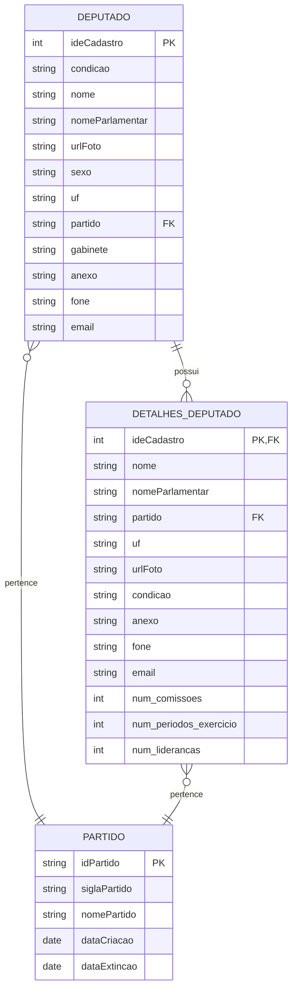

https://www2.camara.leg.br/transparencia/dados-abertos/dados-abertos-legislativo/webservices/deputados/deputados

Relações Principais:
DEPUTADO → DETALHES_DEPUTADO: Relação 1:1 através de ideCadastro

DEPUTADO → PARTIDO: Relação N:1 através de partido → siglaPartido

DETALHES_DEPUTADO → PARTIDO: Relação N:1 através de partido → siglaPartido