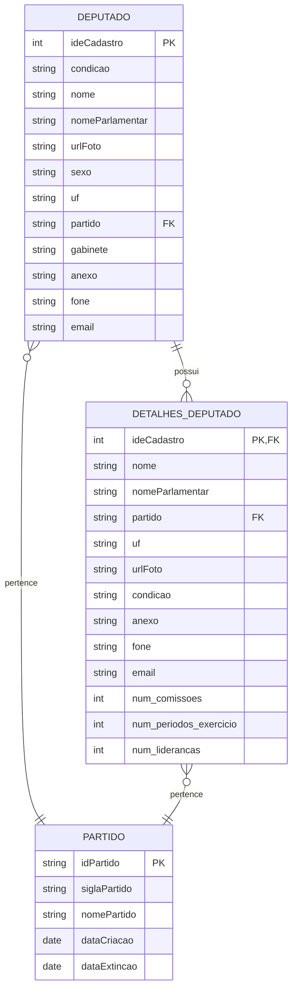

# Projeto: Coleta de Dados de Deputados e Partidos da Câmara dos Deputados

Este projeto automatiza a **coleta, processamento e armazenamento de dados** sobre deputados e partidos da Câmara dos Deputados do Brasil, utilizando os **Web Services oficiais de dados abertos**. Os dados são salvos no **Amazon S3** para análise ou integração com outros sistemas.

---

## 🔗 Referência Oficial

* [Web Services de Deputados - Câmara dos Deputados](https://www2.camara.leg.br/transparencia/dados-abertos/dados-abertos-legislativo/webservices/deputados/deputados)

---

## 📦 Estrutura do Projeto

* **Lambda Functions**: Funções AWS Lambda responsáveis por coletar e processar os dados.
* **S3 Bucket**: `dev-lab-02-us-east-2-landing/camara/deputados` para armazenamento dos arquivos JSON.
* **EventBridge**: Agendamento de execução automática das Lambdas.
* **Dados obtidos**:

  * Deputados em exercício
  * Detalhes completos de cada deputado
  * Partidos políticos e suas informações históricas

---

## 📊 Modelo de Dados

### Relações principais

* **DEPUTADO → DETALHES\_DEPUTADO**: 1:1 via `ideCadastro`
* **DEPUTADO → PARTIDO**: N:1 via `partido → siglaPartido`
* **DETALHES\_DEPUTADO → PARTIDO**: N:1 via `partido → siglaPartido`

---

## ⚙️ Funcionamento das Lambdas

1. **Obter Deputados**

   * Coleta dados de todos os deputados em exercício.
   * Se a URL principal falhar, tenta a alternativa.
   * Campos principais: `ideCadastro`, `nome`, `nomeParlamentar`, `partido`, `uf`, `email`, `gabinete`, etc.

2. **Obter Detalhes de Deputados**

   * Para cada deputado, obtém detalhes adicionais como:

     * Número de comissões
     * Número de períodos de exercício
     * Histórico de lideranças
   * Combina os dados básicos com os detalhes em JSON completo.

3. **Obter Partidos**

   * Lista todos os partidos, ativos e extintos.
   * Campos: `idPartido`, `siglaPartido`, `nomePartido`, `dataCriacao`, `dataExtincao`.

---

## 📂 Armazenamento no S3

* **Bucket:** `dev-lab-02-us-east-2-landing`
* **Prefixo:** `camara/deputados/`
* **Formato:** JSON
* **Exemplo de arquivo:** `deputados_20250824_120500.json`

---

## 📝 Observações

* As funções usam **urllib** para requisições HTTP, garantindo compatibilidade com Lambda sem dependências externas.
* Os dados são salvos com codificação UTF-8 e indentação de 2 espaços.
* Em caso de falha na coleta principal, é feita uma tentativa em URL alternativa (`www.camara.gov.br`).

